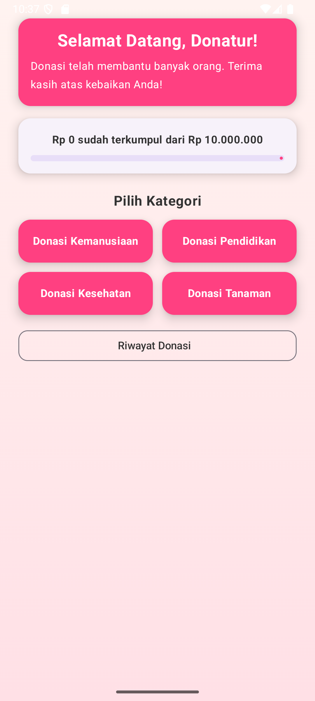
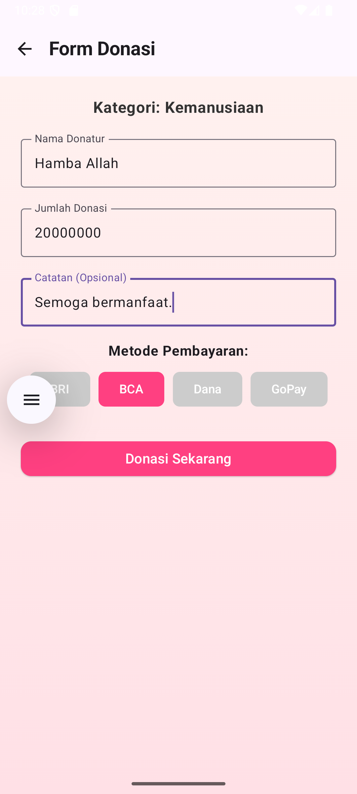
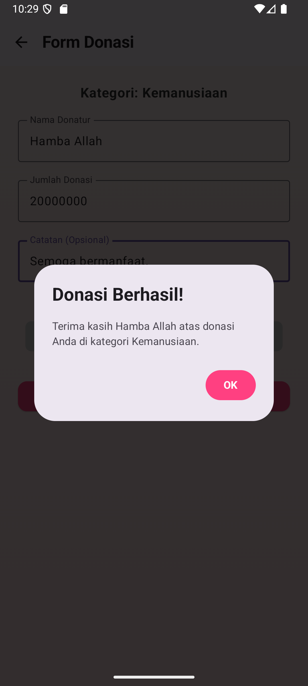
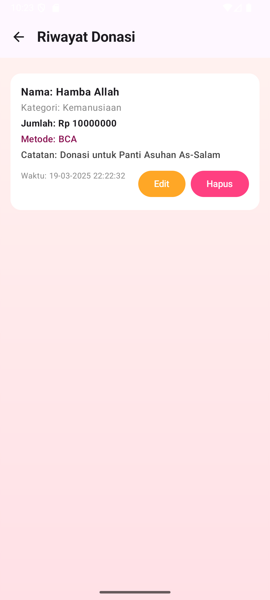
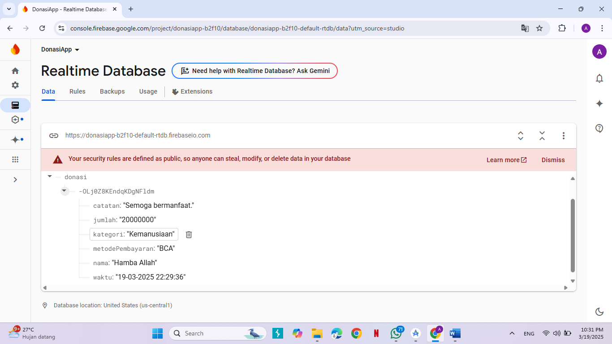

# 📱 Donasi Galang Dana App

Aplikasi Android berbasis **Kotlin** yang dirancang untuk mempermudah proses penggalangan dana dan donasi. Aplikasi ini memungkinkan pengguna untuk membuat kampanye donasi, memberikan donasi, serta mengelola data donasi dengan mudah melalui antarmuka yang intuitif.

## 🚀 Fitur Utama

- **Autentikasi Pengguna**: Sistem login dan registrasi untuk keamanan data.
- **Buat Kampanye Donasi**: Pengguna dapat membuat kampanye donasi dengan detail yang lengkap.
- **Donasi**: Memberikan donasi pada kampanye yang tersedia.
- **Riwayat Donasi**: Melihat daftar donasi yang telah dilakukan.
- **Edit & Hapus Donasi**: Mengelola donasi yang telah dibuat.
- **Progress Bar**: Menampilkan progres pengumpulan dana secara visual.
- **Integrasi Firebase**: Menggunakan Firebase Realtime Database untuk penyimpanan data secara real-time.

## 🛠️ Teknologi yang Digunakan

- **Kotlin**: Bahasa pemrograman utama untuk pengembangan aplikasi Android.
- **Android Studio**: Lingkungan pengembangan terintegrasi (IDE) untuk Android.
- **Firebase Realtime Database**: Basis data real-time untuk penyimpanan dan sinkronisasi data.
- **Material Design**: Desain antarmuka pengguna yang modern dan responsif.

## 📸 Tangkapan Layar







## ⚙️ Instalasi dan Penggunaan

1. **Clone repositori ini**:

   ```bash
   git clone https://github.com/Mankunawabu/donasi-galang-dana-app.git
2. Buka proyek di Android Studio:

  - Buka Android Studio.

  - Pilih "Open an existing project".

  - Arahkan ke folder donasi-galang-dana-app.

3. Konfigurasi Firebase:

  - Buat proyek baru di Firebase Console.

  - Aktifkan Authentication dan Realtime Database.

  - Unduh file google-services.json dan letakkan di direktori app/.

4. Sinkronisasi Proyek:

  - Klik "Sync Now" di Android Studio untuk menyinkronkan proyek dengan Gradle.

5. Jalankan Aplikasi:

  - Pilih emulator atau perangkat fisik.

  - Klik "Run" untuk menjalankan aplikasi.

## 🤝 Kontribusi
Kontribusi sangat terbuka! Jika Anda ingin memperbaiki bug, menambahkan fitur, atau meningkatkan dokumentasi, silakan fork repositori ini dan ajukan pull request.

## 📄 Lisensi
Proyek ini dilisensikan di bawah MIT License.


